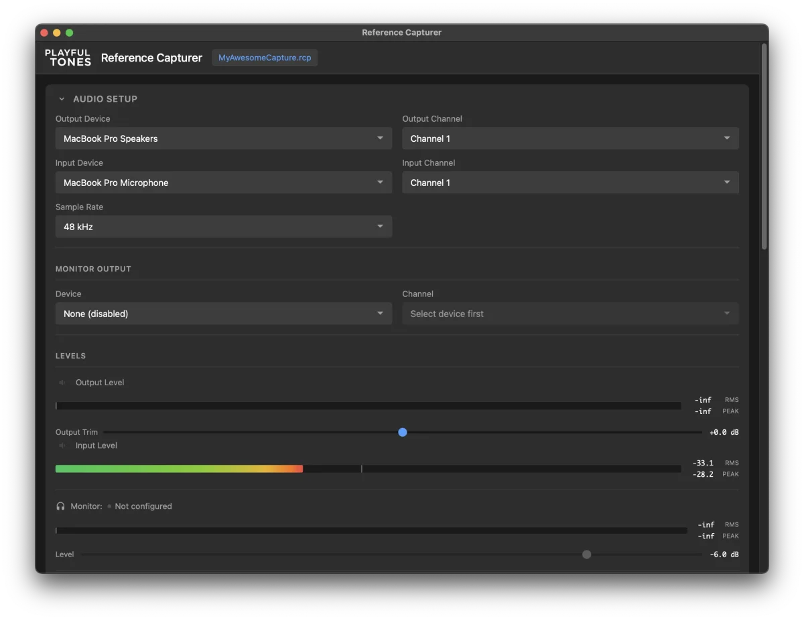
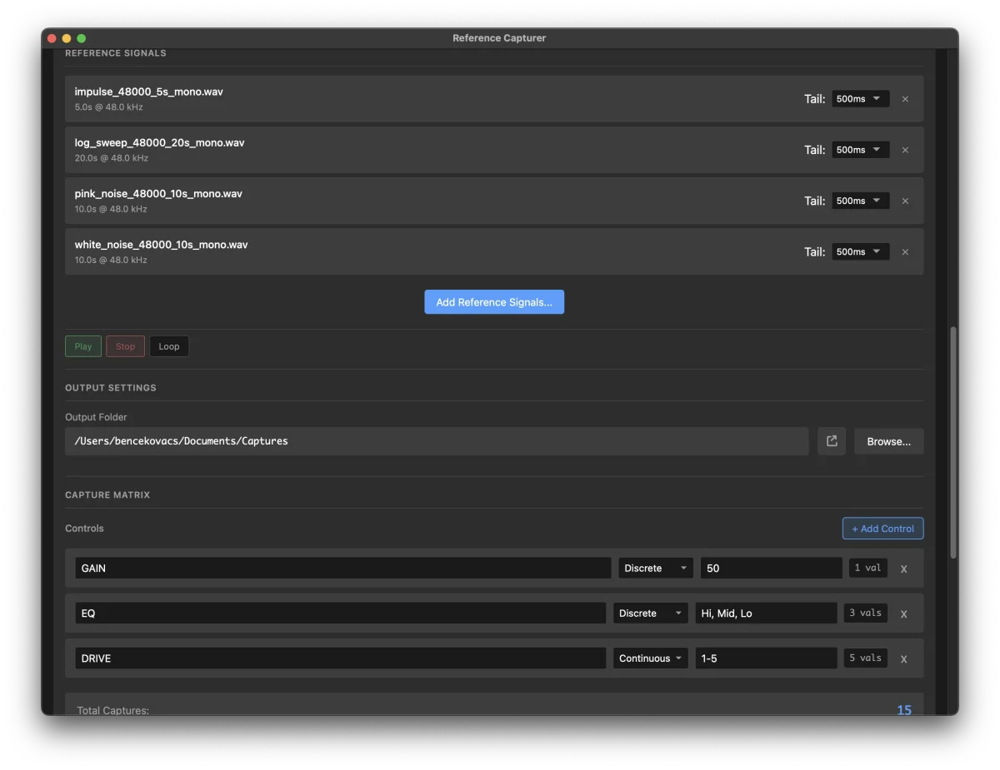
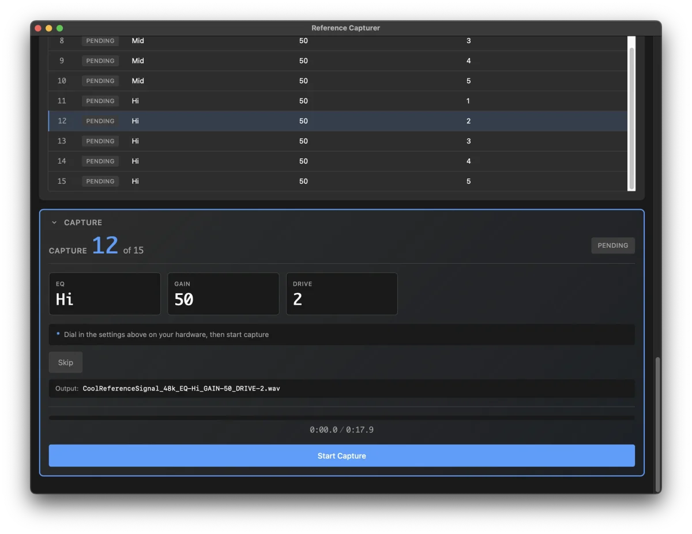
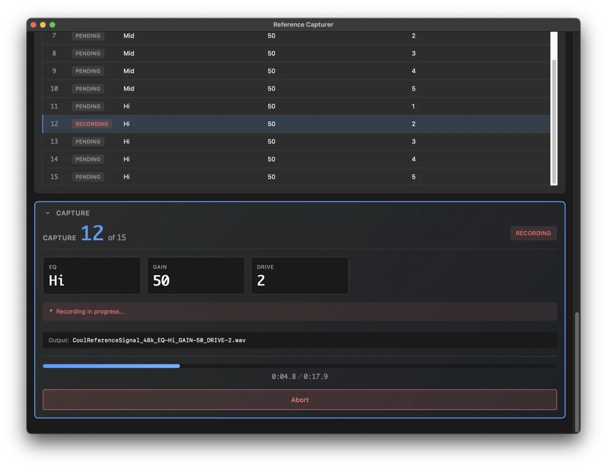
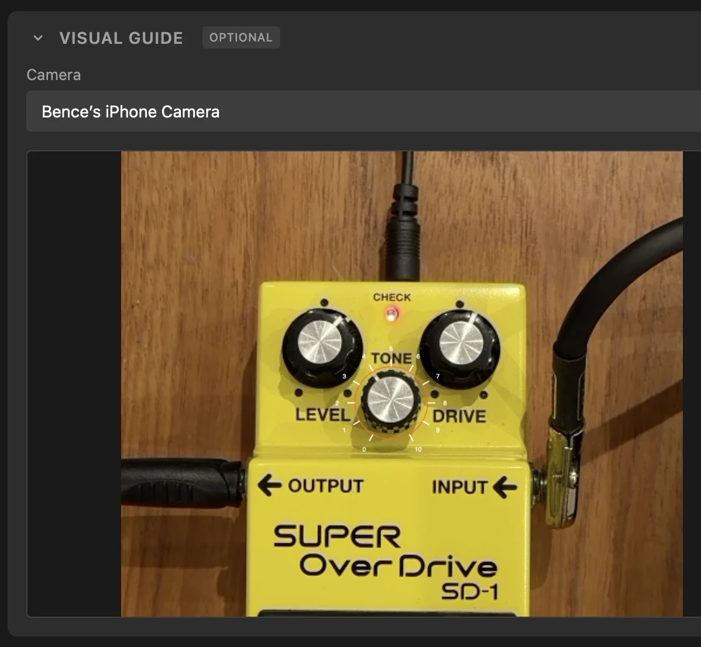

# Reference Capture Tool

A standalone macOS desktop application for capturing audio through hardware units (pedals, amps) with systematic parameter variations. Built with JUCE 8 and a WebView-based UI.

## Features

- **Audio I/O Setup**: Device enumeration, input/output channel selection, sample rate configuration (44.1/48/96 kHz)
- **Real-time Metering**: Input and output level meters (RMS + peak, dBFS) with output trim control
- **Calibration Wizard**: 4-step guided workflow for gain staging before capture sessions
- **Reference Signals**: Load multiple mono WAV files with per-signal tail settings, preview playback
- **Capture Matrix**: Define controls (continuous/discrete) and values, auto-generate capture list as cartesian product
- **Capture Workflow**: Synchronized playback + recording, auto-cycles through all reference signals per capture, auto-advance through captures
- **Auto-export**: Standardized naming convention (`{signal}_{samplerate}_{control1}-{value1}_...wav`)
- **Capture Log**: JSON metadata for ML training pipeline
- **Project Persistence**: Save/load sessions, auto-save after each capture



## Architecture

```
+---------------------------------------+
|            Main Window                |
|  +-------------------------------+    |
|  |       WebView (UI)            |    |
|  |  HTML/CSS/JS from Resources/  |    |
|  +-------------------------------+    |
|                 |                     |
|                 v                     |
|  +-------------------------------+    |
|  |        C++ Backend            |    |
|  |  AudioEngine | CaptureList |  |    |
|  |       ProjectState            |    |
|  +-------------------------------+    |
+---------------------------------------+
```

## Requirements

- macOS (primary target)
- JUCE 8 (included as submodule)
- CMake 3.22+
- C++17 compatible compiler
- Ninja (if using the build shell script)

## Building

```bash
./build.sh
```

The built application will be in `build/ReferenceCapturer_artefacts/`.

## Usage

### Quick Start

1. **Audio Setup**: Select input/output devices and channels
2. **Calibrate**: Run the calibration wizard to set proper gain staging
3. **Load Reference Signals**: Browse for one or more mono WAV files (each gets its own tail setting)
4. **Define Matrix**: Add controls with values you want to capture (e.g., GAIN: 0, 25, 50, 75, 100)
5. **Generate List**: Click "Generate Capture List" to create capture combinations
6. **Set Output Folder**: Choose where captured files will be saved
7. **Capture**: For each entry, dial in the physical settings and capture



### Capture Matrix Example

Define controls like:
- `MODE` (discrete): UP, MID, DOWN
- `GAIN` (discrete): 0, 25, 50, 75, 100
- `SHAPE` (continuous): 1-10:1

This generates 150 capture entries (3 x 5 x 10). If you have 2 reference signals loaded, each entry produces 2 recordings (300 total files).



### Output Files

With multiple reference signals, each capture entry records once per signal. Files are named automatically using the signal name:
```
test_di_01_48k_MODE-UP_GAIN-75_SHAPE-10.wav
test_di_02_48k_MODE-UP_GAIN-75_SHAPE-10.wav
```

A `capture_log.json` file tracks all capture metadata for ML pipeline consumption.



### Project Files

Projects are saved as JSON and include:
- Audio device settings
- Calibration data
- Reference signals (paths and per-signal tail settings)
- Capture matrix definition
- Capture list with completion status
- Output folder path
- Visual guide state (if used)

### Visual Capture Guide

An optional camera overlay feature to help dial in physical knob settings during capture sessions. The guide displays a webcam feed with visual overlays that can be positioned over hardware controls.



**Features:**
- Camera selection and live preview
- Create guides per control from the capture matrix (click "+ Guide" button)
- Position guides by dragging on the canvas
- Adjust arc range to match knob rotation limits
- Fine-tune via the Guide Properties panel
- Guides persist with project save/load
- Auto-delete when associated control is removed

**Usage:**
1. Expand the "Visual Guide" section
2. Select a camera and click "Start Camera"
3. In the Capture Matrix, click "+ Guide" next to a control
4. Position the guide circle over the physical knob in the camera view
5. Drag the arc handles to match the knob's min/max rotation
6. During capture, the guide shows tick marks for each value to help dial in settings

The guide module is entirely optional and doesn't affect the capture workflow if not used.

## Development

### Build Commands

```bash
./build.sh          # Full build
./build.sh --clean  # Clean rebuild
```

## Constraints

- **Mono only**: Reference signals and captures are mono
- **macOS**: Primary target platform (JUCE supports others but untested)
- **WAV format**: PCM, no lossy compression

## Bugs

This is a hastily vibecoded prototype, riddled with several known bugs and almost certainly some unknown ones lurking in the shadows. It does what I need it to do right now, so these issues may or may not ever get fixed. PRs are welcome if you stumble upon fixes or improvements.

## License

AGPLv3
